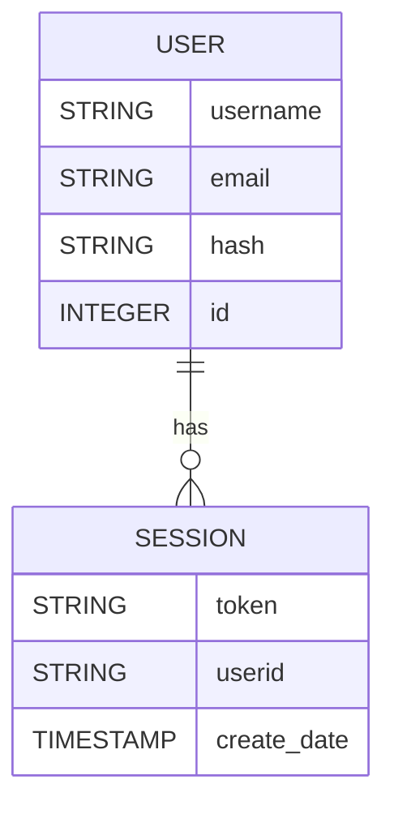

BigQuery est une base de données étant en mesure de gérer des térabytes de données sans difficultés. Une requête sur plusieurs térabytes peut être terminée à une vitesse folle. Le prix pour l'utilisation de BigQuery est relié à la quantité de données parcourue durant la requête. Ici pour notre application nous aurons peu de données et ainsi nous pourrons utiliser BigQuery gratuitement. 

> [!danger] BigQuery peut être très dispendieux pour de grandes quantités de données il est donc important d'assurer que l'application n'aura pas de problème créant des boucles effectuant plein de requêtes. 

> [!hint] Ici il est une bonne pratique de mettre en place des quotas d'utilisation pour éviter des charges provenant des ressources que vous utilisez.

Aller chercher BigQuery à partir du panneau de gauche

Dans l'explorateur, créez un ensemble de données

Pour éviter des couts et problème prendre simplement une région vous pouvez prendre Montréal qui possède un centre de données.

> [!warning] Pour votre implémentation utiliser une seule région car ça permet de simplifier l'intégration avec les fonctions. **NE PAS UTILISER MULTIRÉGION**

Ici nous allons créer une structure de données pour expérimenter avec BigQuery. La structure créé ici est celle utilisé par les fonctions `create-user` et `session` de l'enseignant. Bien que ces fonctions ne sont pas fournit cette démonstration vous permet d'expérimenter avec la base de données et aussi voir la structure de données pour cette section

> [!important] BigQuery est différent d'une base de données classique, car elle est destinée à gérer des données larges. Ainsi ils ont retiré des contraintes ACID pour permet d'y parvenir. Pour les besoins de notre application, cette particularité ne nous nuira pas, mais elle requiert que votre application assure l'intégrité des requêtes.

>[!warning] Ici le code n'est pas fourni car pour le TP vous devez utiliser API de l'enseignant et la distribution de ces APIs dans le passée créait de la confusion.

## Structure de données

### users

Permets de contenir les utilisateurs créés par l'API. Le code de base contient les éléments permettant de créer des utilisateurs, des sessions pour ces utilisateurs et vérifier que le token de session fourni est valide. Ceci pour permet d'avoir une solution de base permettant de faire une gestion d'usager dans votre application.

> [!Rappel] ici c'est une exemple de base de donnée pour la gestion de session cependant pour le TP les fonctionnalités sont fournies par l'enseignant et vous n'aurez pas à utiliser les tables créés ici.

| Champ    | Type    | Mode     | Description                                                                     |
| -------- | ------- | -------- | ------------------------------------------------------------------------------- |
| username | STRING  | REQUIRED | Nom de l'utilisateur                                                            |
| email    | STRING  | REQUIRED | Courriel de l'utilisateur                                                       |
| hash     | STRING  | REQUIRED | Hash encryptant le mot de passe [^1]                                            |
| id       | INTEGER | REQUIRED | ID de l'utilisateur pouvant permettre de créer des relations avec d'autre table |
|          |         |          |                                                                                 |

### sessions

| Champ       | Type      | Mode     | Description                                                |
| ----------- | --------- | -------- | ---------------------------------------------------------- |
| token       | STRING    | REQUIRED | Token de session                                           |
| userid      | STRING    | REQUIRED | ID de l'utilisateur pour ce Token                          |
| create_date | TIMESTAMP | REQUIRED | Date de création du Token permettant de valider la session |

[^1]: Ici le Hash est simpliste et cette implémentation n'est que peu protégée pour des attaques. Ces services sont destinés à la formation et le code est très simpliste pour permettre une lecture rapide.

## Création d'une table

## Utilisation de l'interface

Lorsque votre table est crée il est possible d'utiliser l'interface pour interagir avec votre base de données

[24f - Creation de fonction](24f%20-%20Creation%20de%20fonction.md)